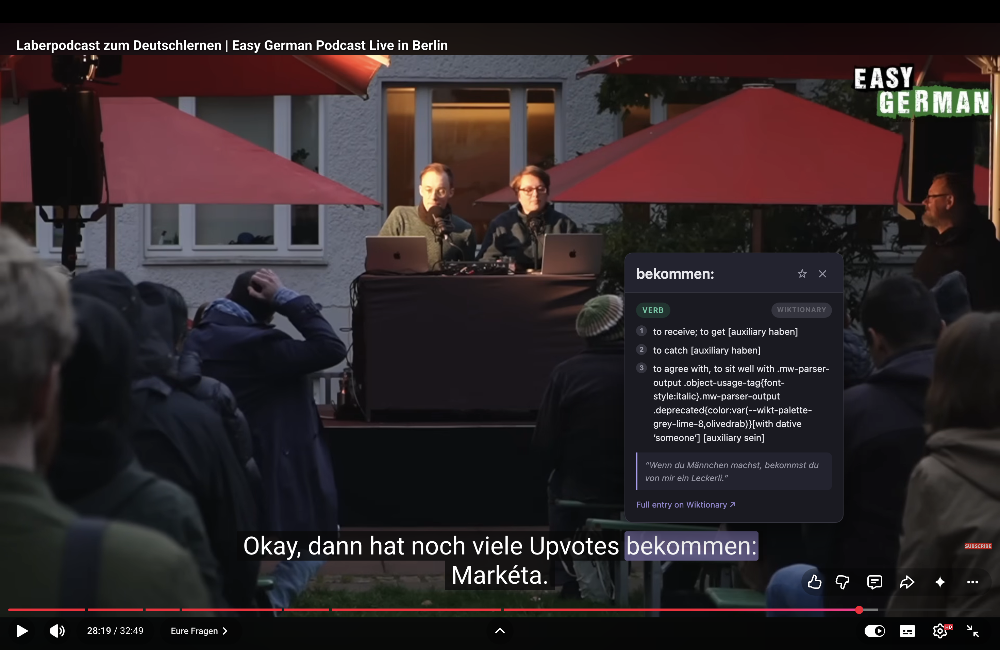
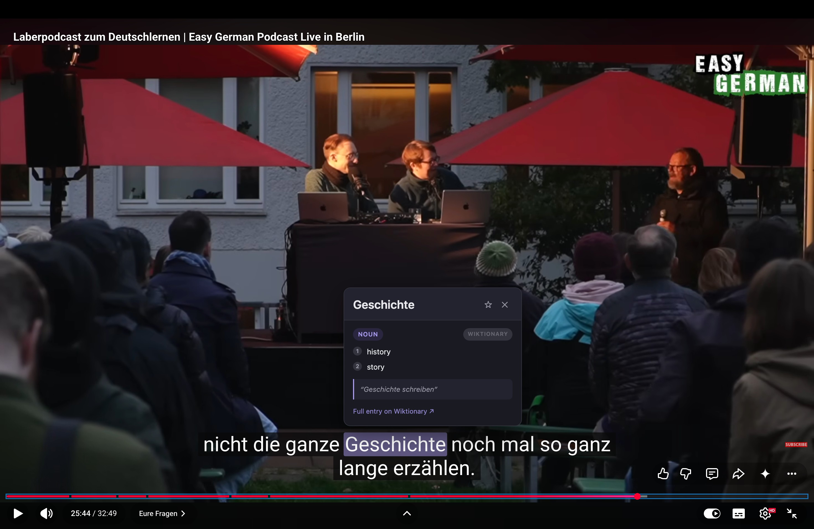
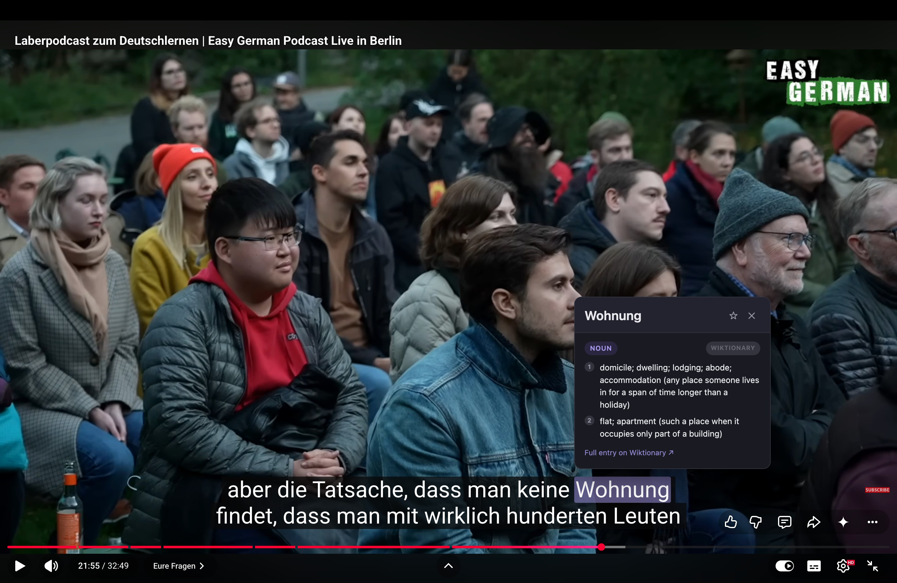
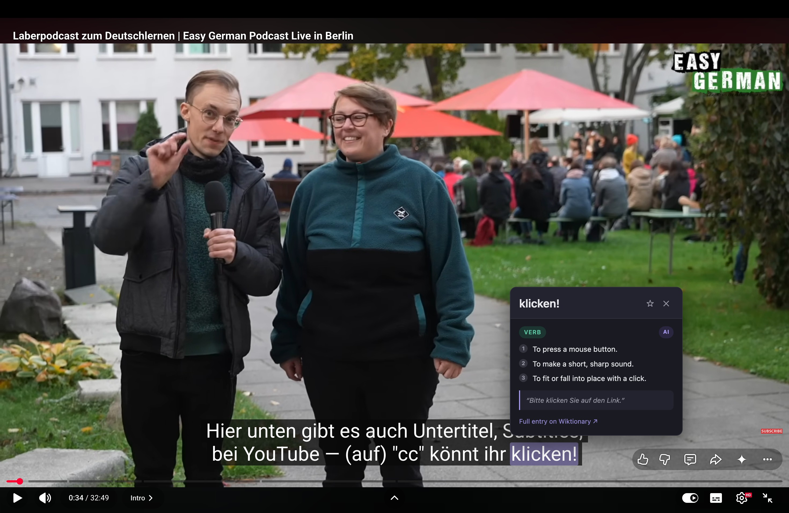

# German Word Clicker

A Chrome extension I built to make learning German through YouTube and Netflix less painful. Click any word in the subtitles and you get the meaning, gender, and an example sentence right there — no pausing, no switching tabs.

**Try the demo**: open [`demo/index.html`](demo/index.html) in your browser — works without installing anything, just sample subtitles to click around.

---

## Screenshots

| Verb lookup | Noun lookup |
|:-----------:|:-----------:|
|  |  |
| *Clicking a verb: **bekommen** with Wiktionary fallback* | *Clicking a noun: **Geschichte** with gender badge* |

| Full example in context | AI-powered lookup |
|:-----------------------:|:----------------:|
|  |  |
| *Word **Wohnung** highlighted in subtitle, popup inline* | *AI mode: **klicken!** with clean English definitions* |

---

## Why I made this

When I was watching German videos to practice, every time I didn't know a word I had to pause, open a new tab, type the word into a dictionary (and sometimes guess the base form first), then go back and try to remember where I was.

It got annoying fast. So I built this — you just click the word and the definition shows up instantly.

---

## How it works

When a subtitle appears on screen, the extension wraps each word in a `<span>` so they're individually clickable. When you click one, it first tries the Gemini API (free tier) to get a clean English definition and the base form if it's conjugated. If that fails or no key is set, it falls back to Wiktionary automatically.

The result pops up near the word — part of speech, gender for nouns, 2-3 definitions, and an example sentence. You can also star words to save them to a vocab list.

---

## Features

- Click any word in German subtitles on YouTube or Netflix to look it up
- Uses Gemini API (free) as the primary source — handles conjugated/inflected forms well
- Falls back to Wiktionary if no API key is set or the AI call fails
- Shows noun gender (der/die/das) as a colored badge
- Save words to a personal vocab list, stored locally, exportable as CSV for Anki
- Caches results for 24 hours so the same word doesn't hit the network twice
- MutationObserver is scoped to the video player only and throttled to 400ms — doesn't slow down playback

---

## Tech stack

I kept it simple on purpose — no frameworks, no npm, no build step:

| Layer | Technology |
|-------|-----------|
| Structure | HTML5 |
| Styling | CSS3 (custom properties) |
| Logic | Vanilla JavaScript (ES6+) |
| Primary definitions | Gemini API free tier |
| Fallback definitions | Wiktionary REST API |
| Storage | chrome.storage.local |

---

## Project structure

```
german-word-clicker/
├── extension/              Chrome extension (Manifest V3)
│   ├── manifest.json       Extension config
│   ├── content.js          Injected into YouTube/Netflix
│   ├── config.example.js   Template for your Gemini API key
│   ├── config.js           Your actual key — gitignored
│   ├── popup.html / .js    Toolbar popup — saved vocab list
│   ├── styles.css          Popup and word styling
│   └── icons/              Extension icons (16/48/128px)
├── demo/
│   └── index.html          Standalone demo — no install needed
└── README.md
```

---

## Installation

1. Clone or download this repo
2. **(Optional)** Set up the Gemini API key for better lookups:
   - Go to [aistudio.google.com/apikey](https://aistudio.google.com/apikey) and sign in with a Google account
   - Click **Create API key** and copy it
   - In `extension/`, copy `config.example.js` → `config.js` and paste your key
   - If you skip this, it just uses Wiktionary — still works fine
3. Open `chrome://extensions` in Chrome
4. Enable **Developer mode** (top right)
5. Click **Load unpacked** and select the `extension/` folder
6. Open a YouTube video, turn on German subtitles, and start clicking words

---

## Gemini free tier

Each word lookup is a tiny request and results are cached locally for 24 hours, so the free quota is more than enough for normal use. If the quota runs out or no key is set, it just falls back to Wiktionary without showing any error.

---

## Some implementation notes

**MutationObserver scope** — an earlier version watched `document.body` which fired on every UI update YouTube makes and caused noticeable lag. Scoping it to the video player container and throttling to 400ms fixed that.

**AI + fallback, not AI only** — if the extension depended only on the Gemini API it would break whenever the key is missing or rate-limited. Wiktionary as a fallback means it always returns something.

**API key out of version control** — the key goes in `config.js` which is gitignored. It gets loaded as a separate content script before `content.js`. Standard approach for this kind of client-side project.

**Caching** — results are stored in memory and in `chrome.storage.local` with a 24h expiry, so re-clicking the same word is instant.

---

## Ideas for later

- Support for more streaming platforms
- Better inflected-form handling (e.g. clicking *gelaufen* resolves to *laufen*)
- Anki `.apkg` export
- Firefox port

---

## License

MIT — see LICENSE
